| 🌰 DotoriWebpage 🌰 |  
|:-------------:|
|   |

## 🎫 배포 사이트

### ✔️ https://sinyoung0403.github.io/DotoriWebpage/
- 메인 페이지에서 방명록을 쓸 수 있습니다.
- 상세 페이지에서는 각 팀원의 소개를 볼 수 있습니다.
- 취미 페이지에서는 취미 등록 및 삭제가 가능합니다.
- 스크럼 페이지에서는 목표를 추가, 삭제, 편집, 완료 여부를 저장할 수 있는 기능을 제공합니다.
 
 

## ⚒ 개발 팀 소개

| 역할 | 팀장 |  팀원 | 팀원|
|:-------------:|:-------------:|:-------------:|:-------------:|
|프로필||||
|이름|박신영|김규현|김채진|
|GitHub|sinyoung0403|0122-0|kmchaejin|
|기술블로그|[신영tistory](https://sintory-04.tistory.com/)|[규현velog](https://velog.io/@flowercat95/posts)|[채진tistory](https://go-getter1kim.tistory.com/)|

 
 

## ⚒ 프로젝트

### ✔️ 프로젝트 이름

- **" Dotori Webpage "**

### ✔️ 프로젝트 소개

- 저희의 Web application은 메인페이지(방명록), 취미페이지, 데일리 스크럼 페이지로 구성되어 있습니다.
- 각 페이지에서는 직관적인 인터페이스를 통해 항목을 추가, 삭제, 및 편집을 할 수 있습니다.
- Firebase의 `JavaScript SDK`와 `Fetch`를 활용하여 real-time data storage를 구현했습니다.
- `HTML`, `CSS`, `Bootstrap` 으로 디자인 하였으며, `JS`와 `Jqery`를 활용하여 데이터의 실시간 반영, 동적관리 등을 통해 사용자와의 상호작용을 강화했습니다.

 
 

## 🌟 주요 기능 

#### 1️⃣ 방명록 Create, Read, Delete 구현
#### 2️⃣ 데일리 스크럼 Create, Read, Update, Delete 구현
#### 3️⃣ 취미 Create, Read, Delete 구현

 
 

## 💡 구현된 기능

### ✔️ 메인 페이지 

1️⃣ 조회
- 방명록 조회

2️⃣ 추가
- 방명록 버튼 클릭 시, 입력 폼 토글 동작
- 입력폼 기록하기 버튼 클릭 시, 모달 동작

  → 모달의 생성하기 버튼 클릭 시, 페이지 리로드 & 방명록 데이터 추가

3️⃣ 삭제
- 방명록 삭제 버튼 클릭 시, 모달 동작
  
  → 모달의 삭제하기 버튼 클릭 시, 페이지 리로드 & 방명록 데이터 삭제

4️⃣ 기타

- Bootstrap의 `carousel`를 통해 팀 소개, 팀 목표, 팀 약속 조회
- `Fetch API` 를 통해 날씨 `API` 제공

 

### ✔️ 상세 페이지 
- Bootstrap의 `carousel` 배치
- Bootstrap의 `collapse` 배치
- Bootstrap의 `accordion` 배치

 

### ✔️ 데일리 스크럼 페이지

1️⃣ 조회
- 일자별 데일리 스크럼 목록 조회
- 데일리 스크럼 버튼 클릭 시, 상세 정보 토글로 조회

2️⃣ 추가
- 입력 폼에 팀 목표, 개별 목표 작성 후 기록하기 버튼 클릭 시, 모달 동작
  
  → 모달의 추가하기 버튼 클릭 시, 페이지 리로드 & 방명록 데이터 추가  

3️⃣ 삭제
- 삭제하기 버튼 클릭 시, 모달 동작

  → 모달의 삭제하기 버튼 클릭 시, 페이지 리로드 & 데이터 삭제

4️⃣ 수정
- 각 스크럼 항목의 수정하기 버튼 클릭 시, 개별 수정 창 동적 동작
- 수정완료 버튼 클릭 시, 모달 동작
  
  → 모달의 완료하기 버튼 클릭 시, 페이지 리로드 & 데이터 수정 구현

 

### ✔️ 취미 페이지

1️⃣ 조회

- '펼쳐보기' 버튼을 클릭 시, 토글로 취미 목록 조회

2️⃣ 추가

- 기록하기 버튼 클릭 시, 페이지 리로드 & 취미 데이터 추가 

3️⃣ 삭제

- 삭제하기 버튼 클릭 시, 페이지 리로드 & 취미 데이터 삭제 

4️⃣ 기타
- Bootstrap의 `carousel`를 통해 팀원들의 취미 조회

 
 

## 🏷️ Data

### ✔️ 메인페이지 (방명록)

> 문서 ID 는 JavaScript SDK 를 이용하여 Custom id로 정했습니다.

| | 데이터 이름 |  데이터 형태 | 데이터 설명|
|:-------------:|:-------------:|:-------------:|:-------------:|
| 1 | id |  String | 방명록을 작성한 시점을 밀리초로 환산하여 Id 값을 지정 |
| 2 | name |  String | 방명록 적은 사람의 닉네임 |
| 3 | coment |  String | 방명록 text |
   

###  ✔️ 데일리 스크럼 페이지

> 문서 ID 는 Firebase 에서 랜덤으로 주어진 값을 사용합니다.

|  | 데이터 이름 |  데이터 형태 | 데이터 설명|
|:-------------:|:-------------:|:-------------:|:-------------:|
| 1 | id | String | 스크럼을 추가한 시점을 밀리초로 환산하여 Id 값을 지정 |
| 2 | date | String | 스크럼을 추가한 날짜를 mm월 dd일 형태 저장 |
| 3 | teamAim | String | 팀원 전체 목표 |
| 4 | ghGoal | String | 규현님 개별 목표 |
| 5 | cjGoal | String | 채진님 개별 목표 |
| 6 | syGoal | String | 신영님 개별 목표 |
| 7 | ghchek | String | 규현님 개별 목표 완료 여부 |
| 8 | cjchek | String | 채진님 개별 목표 완료 여부 |
| 9 | sychek | String | 신영님 개별 목표 완료 여부 |
 

###  ✔️ 취미 페이지

> 문서 ID 는 JavaScript SDK 를 이용하여 Custom id로 정했습니다.
> 
| | 데이터 이름 |  데이터 형태 | 데이터 설명|
|:-------------:|:-------------:|:-------------:|:-------------:|
| 1 | id |  String | 취미를 등록한 시점을 밀리초로 환산하여 Id 값을 지정 |
| 2 | name |  String | 기록한 사용자의 이름 |
| 3 | img |  String | 기록한 사용자의 취미를 보여주는 사진 (이미지 주소) |
| 4 | hobby |  String | 기록한 사용자의 취미의 이름 |

 
 

## 📚 Stacks

### ✔️ Environment 
  

### ✔️ Front-End
     

### ✔️ Back-End 
 

 
 

## 💻 Screen Layout

### 메인 페이지

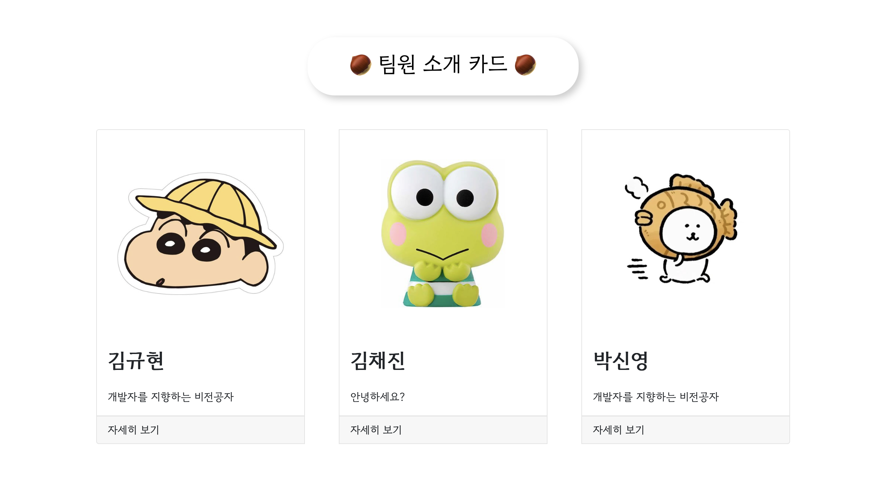
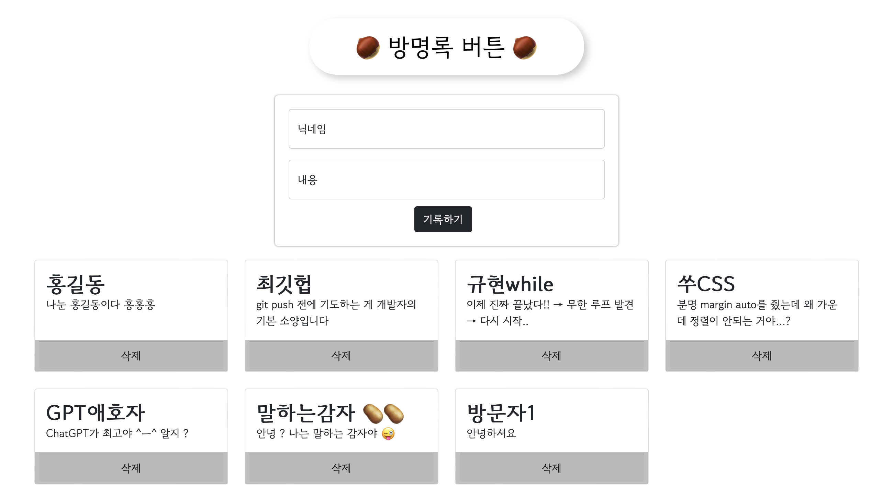

 
 

### 상세 페이지
#### 규현 개인 페이지

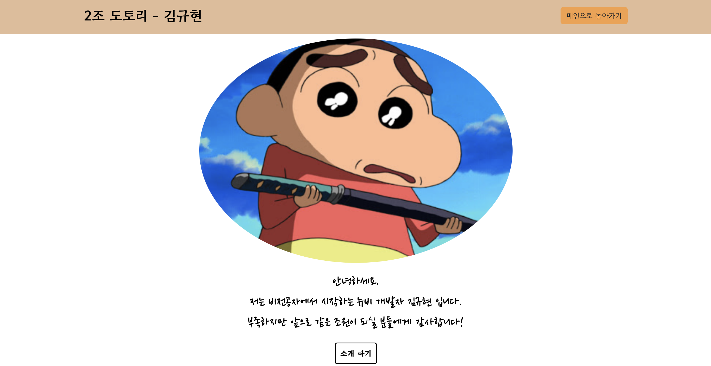

#### 채진 개인 페이지

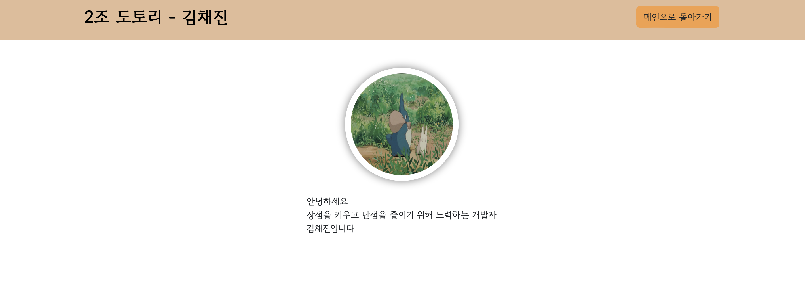
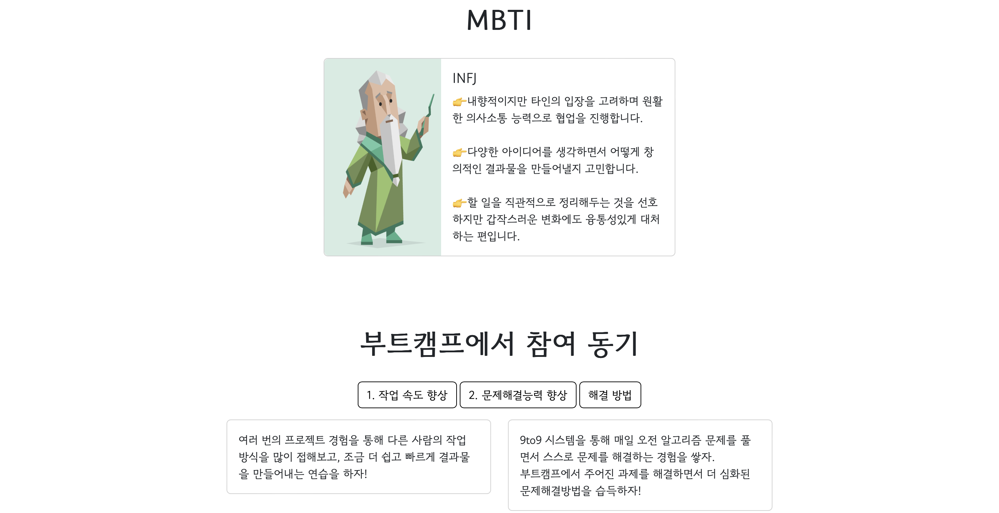
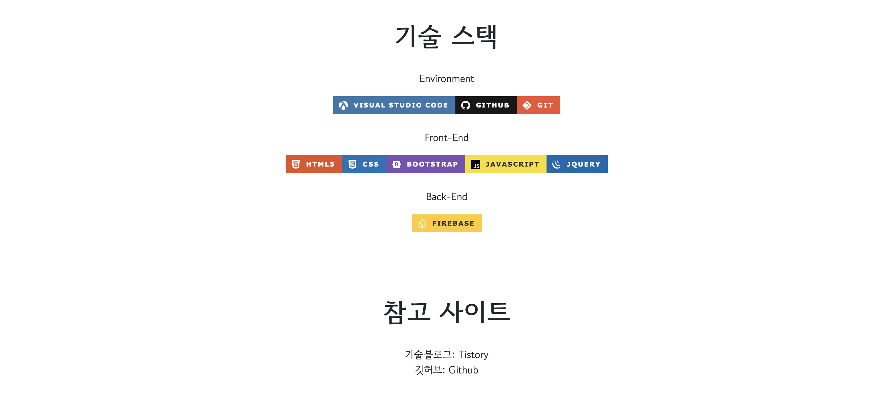

#### 신영 개인 페이지

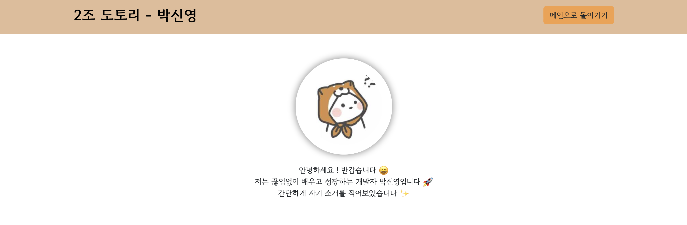
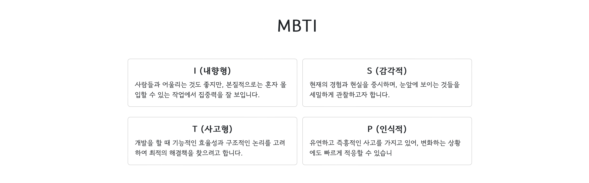
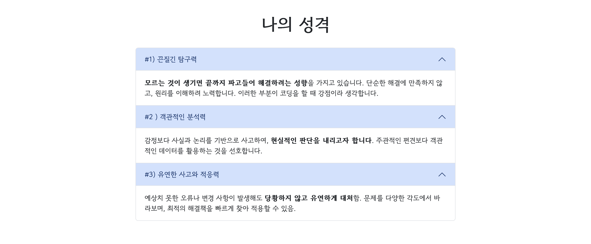
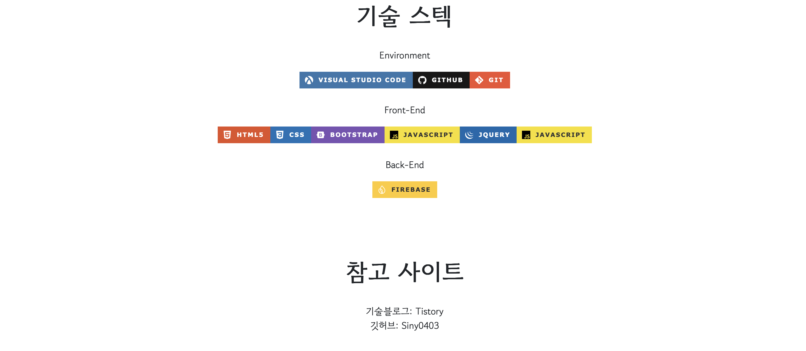

 
 

### 취미 페이지

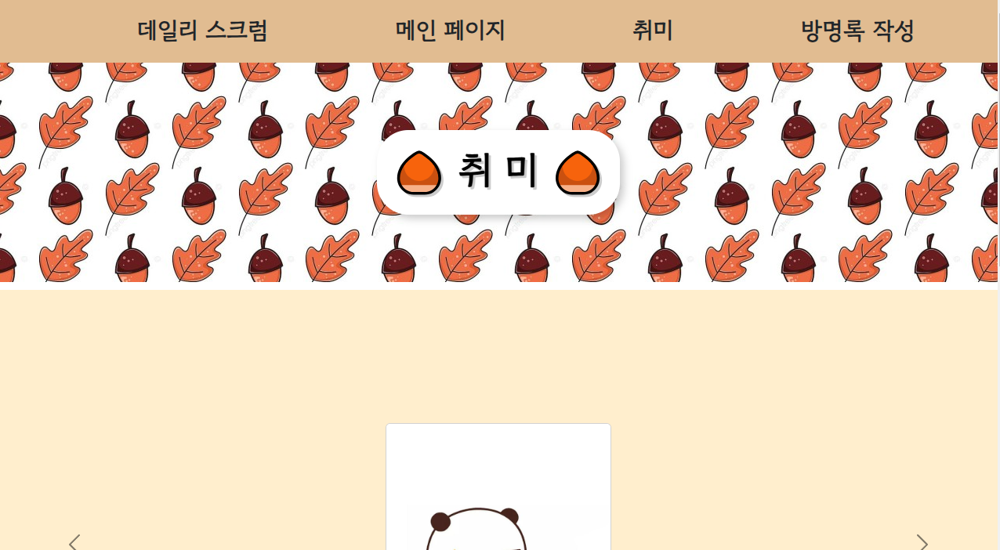
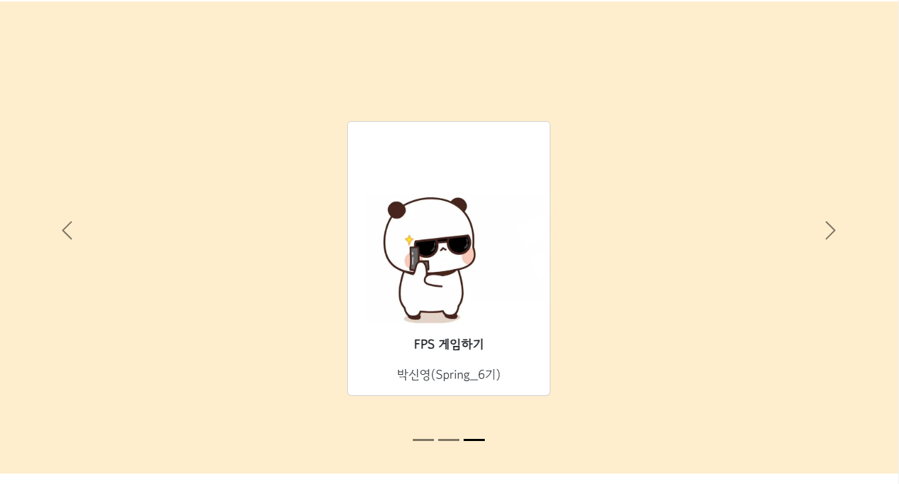

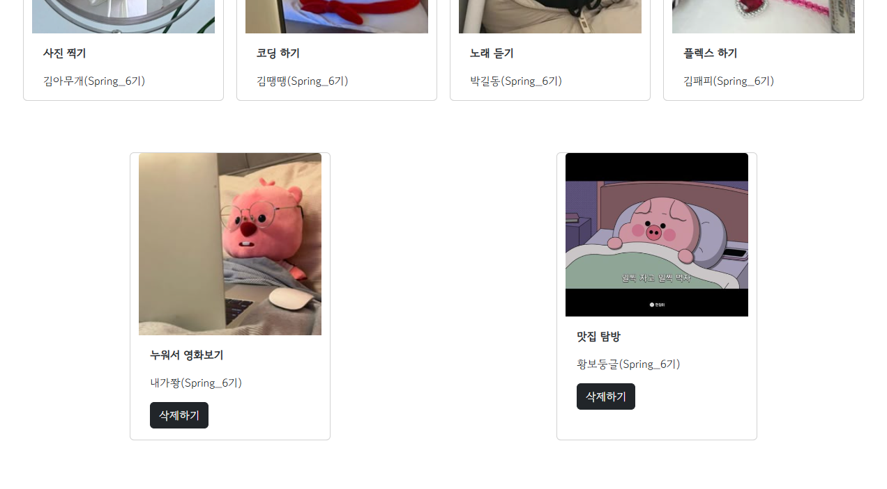

### 데일리 스크럼

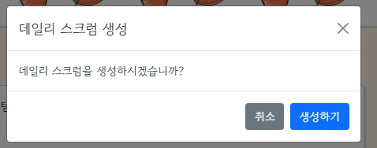
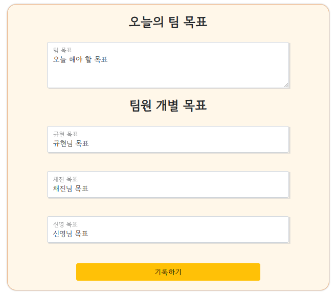
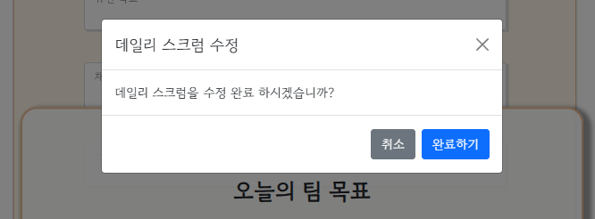
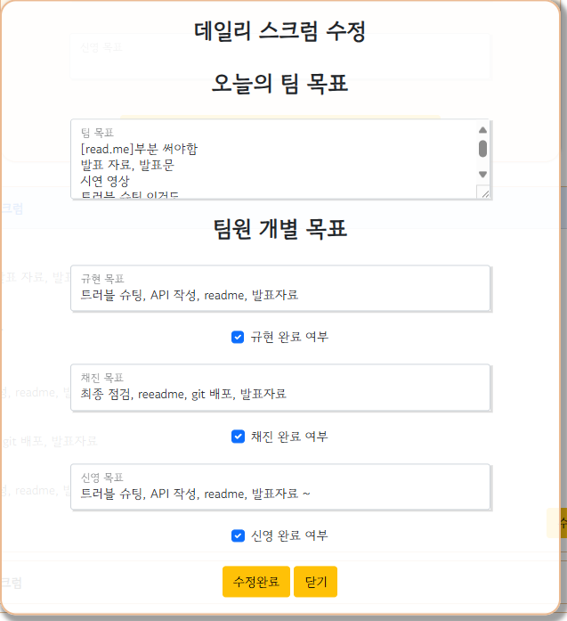
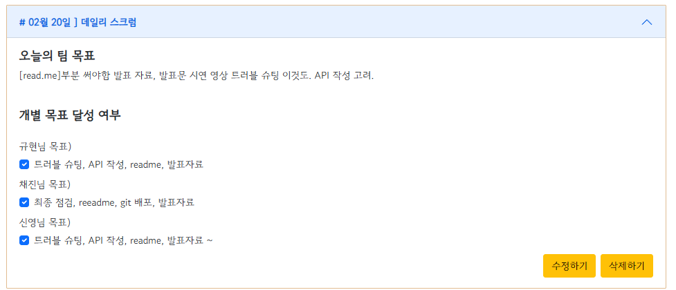
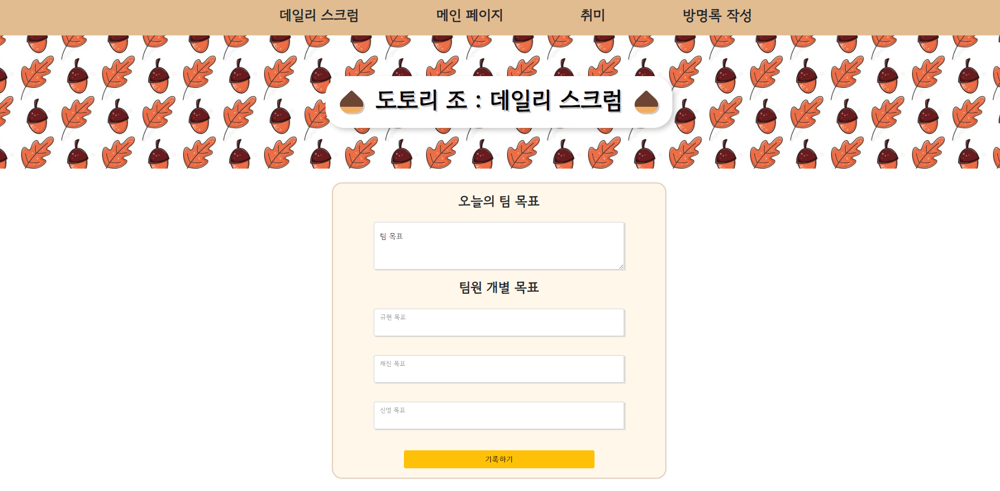

 
 
